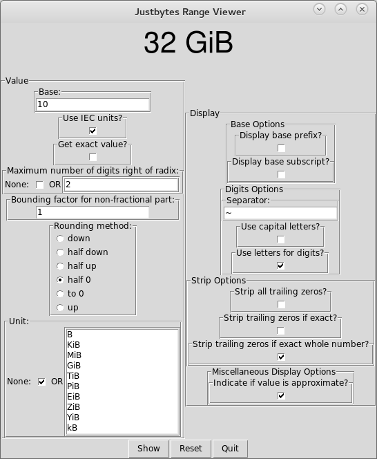

.. justbases documentation master file, created by
   sphinx-quickstart on Tue Feb 17 09:02:33 2015.
   You can adapt this file completely to your liking, but it should at least
   contain the root `toctree` directive.

Justbases
=========

Contents:

.. toctree::
   :maxdepth: 2

   intro
   justbytes_gui/modules
   tests/modules

Screenshot
==========
Justbytes-GUI does not change its appearance that much and always looks more or
less like this:

Indices and tables
==================

* :ref:`genindex`
* :ref:`modindex`
* :ref:`search`

